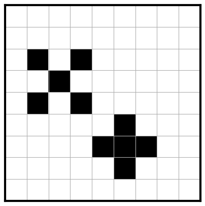
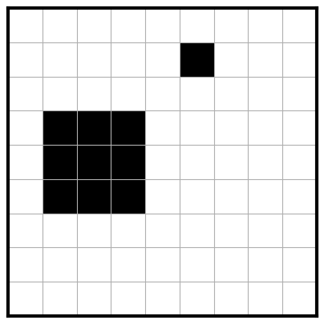

# Image Classification Tasks

This directory provides a library of **synthetic image classification tasks** that serve as controlled benchmarks for the **evolutionary algorithm (EA)**.
The tasks generate images with specific shapes embedded at random positions, along with target locations and distance maps.

These tasks allow the EA to evolve and test candidate solutions in a structured environment.

## Contents

* **`ImageClassification`**
  Abstract base class for synthetic image classification tasks.

  * Handles storage of images, distance maps, and goal locations.
  * Provides helper functions such as plotting and distance map generation.

* **`CrossClassification`**
  Task that generates images with an **X** and a **+** placed at random non-overlapping positions.

  * Goal location: the center of the **X**.

* **`SquareClassification`**
  Task that generates images with a **small square** and a **large square** at random non-overlapping positions.

  * Goal location: the center of the **large square**.


## Quick Usage

### 1. Import a classification task

```python
from image_classification import CrossClassification, SquareClassification
```

### 2. Generate a dataset

```python
# Example: generate 5 cross classification images of size 16x16
task = CrossClassification(size=16)
task.generate(number=5)

print(len(task.images))          # 5 generated images
print(task.goal_locations[0])    # target location of the first image
```

### 3. Plot an image

```python
# Plot the first image with the goal location marked
img = task.images[0]
task.plot_image(img, guess=task.goal_locations[0])
```

#### Cross Image Example


#### Square Image Example



## Outputs

Each classification task produces:

* **Synthetic images** (NumPy arrays, flattened).
* **Goal locations** (coordinates of the target object).
* **Distance maps** (pixelwise distance from each point to the goal).

These outputs are consumed by the **EA agents** during training and evaluation.

